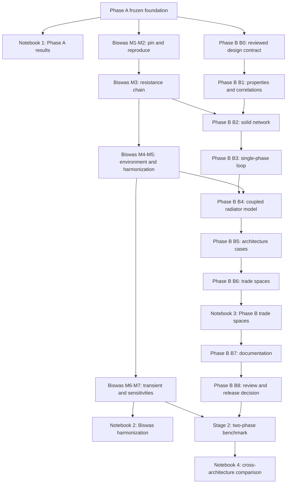

# Orbital Thermal Bounds - Integrated Program Roadmap

> **Status: proposed, forward-looking, provisional, and subject to revision.** This is a
> program-level planning document. It does not authorize implementation or publication, and it
> is not a record of validated results. Its Section 2 records a cross-model **re-review** of
> B0 Revision 1; those dispositions are also tracked in the B0 review record
> ([`../../verification/review-records/`](https://github.com/dan-lee-odinson/orbital-thermal-bounds/tree/main/verification/review-records)).

**Prepared:** 2026-06-21
**Scope:** Phase A foundations, Biswas/Suncatcher reference case, Phase B single-phase
transport, executable notebooks, and deferred two-phase work
**Cross-references:** [`phase-b-roadmap.md`](phase-b-roadmap.md),
[`chip_to_radiator_phase_b_plan.md`](chip_to_radiator_phase_b_plan.md)

## 1. Executive decision

The Biswas/Suncatcher work and the Jupyter notebooks should intersect Phase B without being
absorbed into it.

The program maintains four distinct tracks:

1. **Phase A foundation:** frozen radiator-boundary equations, environment, transient model,
   and existing reference architectures.
2. **Biswas/Suncatcher reference case:** exact reproduction, convention harmonization,
   orbital-environment harmonization, transient comparison, and sensitivities.
3. **Phase B Stage 1:** the new coupled single-phase chip-to-radiator model.
4. **Executable notebooks:** presentation and exploration layers that import tested package
   functions and pinned reference data.

The Biswas reference case can proceed alongside early Phase B work. Its resistance-chain and
radiator results become external checks for B2 and B4. Its complete Suncatcher heat-pipe
architecture cannot become a ranked Phase B Stage-1 case because heat pipes are two-phase; it
becomes a primary Stage-2 benchmark.

## 2. Re-review of the B0 revision

Revision 1 materially improves the original plan. It correctly adds variable roles, absolute
pressure, a pump-energy control volume, per-face orbital loads, correlation domains,
containment applicability, mass-boundary gates, and stronger convergence checks.

**Two blockers remain before B1 authorization.**

### 2.1 Remaining blocker: square-system closure is asserted, not demonstrated

The solve-mode table identifies classes of variables but does not provide the actual thermal
node topology, enumerate every state unknown, or map every unknown to one independent
equation. `T_in/T_out`, intermediate wall/film temperatures, station pressures, pump-heat
feedback, and the active junction constraint are still aggregated into prose.

**Required B0 closure:** add a node-and-equation table for Modes T, A, and S containing:

- every state variable;
- whether it is fixed, solved, derived, or constrained;
- the governing residual;
- the equation count and rank/independence argument; and
- the treatment of heat injected at different nodes.

The table does not need implementation details, but it must show that each proposed mode is
mathematically determinate before numerical methods are selected.

### 2.2 Remaining blocker: direct-solar treatment is incomplete for a bifacial radiator

The revised plan states that the radiator cold face is sun-shielded, then sums a bifacial
per-face balance. It does not state whether every emitting face is shielded, whether the other
face is sunlit, or where direct solar enters when one face is illuminated. This repeats the
geometry boundary that complicated the Starcloud comparison.

**Required B0 closure:** define one of these contracts:

- **fully shielded bifacial case:** both emitting faces receive no direct solar;
- **single cold-face model:** only the shielded face is part of the effective-sink boundary;
  the other face is excluded from the emitting-area claim; or
- **explicit sunlit-face model:** direct solar is included per face using sourced solar
  absorptivity and incidence geometry.

The selected contract must be recorded per case. Missing solar absorptivity must produce an
unresolved or parametric case, never an assumed ranked value.

### 2.3 Required limitation on the mass objective

The prescribed-low-side-pressure mode is acceptable for screening, but a real closed loop
requires charge/compliance or accumulator behavior. Until accumulator and thermal-expansion
mass are closed, the objective must remain **modeled component mass**, not total
thermal-system mass. The existing Section 4.8a rule should state this consequence explicitly.

### 2.4 B0 disposition

**Changes required.** The revision should return for re-review after the two blocker closures
above. No B1 implementation should begin before that re-review.

## 3. Program architecture



## 4. Track A - Phase A foundation

### A0. Freeze the comparison baseline

- Preserve release `v1.0.1` and its reproduction instructions.
- Keep published, corrected, harmonized, and sensitivity cases separate.
- Preserve the exact emitting-area, spectral-load, view-factor, beta-angle, and shielding
  conventions in machine-readable inputs.
- Correct the Earth-view-factor ledger comparator and complete the new
  `radiator-attitude-and-sun-shielding` entry before downstream notebook publication.
  *(Done in B0 Revision 1; see the B0 review record.)*

### A1. Phase A notebook

Create `examples/notebooks/01_phase_a_results.ipynb`. It should reproduce, without
reimplementing equations:

- equilibrium temperature, net rejection, and required area;
- one-sided versus two-sided area conventions;
- exact Earth view factor versus altitude and tilt;
- direct solar, albedo, and Earth IR as separate terms;
- beta-angle sensitivity with the beta-90 albedo limitation;
- fixed-sink versus orbital-boundary cases; and
- existing AI1 and Starcloud published/harmonized cases.

This notebook is not a Phase B prerequisite. It documents the inherited boundary and provides
a visual regression surface for later work.

## 5. Track R - Biswas/Suncatcher external reference case

This track follows a stop-for-review milestone plan. It is not automatically part of a Phase B
release. **Updated per Dr. Biswas's v1.2 response (2026-07-02):** the reference is now a tagged
release with a standalone dependency-free thermal script; the change is a provenance and
sequencing update, and the thermal baseline targets are unchanged.

### R0. Source intake and provenance (new; before reproduction)

- **Pin to release `v1.2`.** Repository
  `https://github.com/Samarjithbiswas/space-based-ai-datacenter`, release tag `v1.2`
  (`.../releases/tag/v1.2`). Author-provided short commit `23053beeff53`.
  **`TODO` (R0 intake):** resolve and record the **full 40-character commit SHA** (the GitHub
  API was not reachable to resolve it here; do not fabricate it).
- Record release URL, tag, full SHA, license, and inspection date in `PINS.json` /
  `provenance.md`.
- Record Dr. Biswas's message as `author-provided clarification`; do **not** quote private
  message text verbatim in public docs without Dan's explicit approval.
- Assign source/provenance labels: `published repository`, `tagged release`,
  `author-provided clarification`, `derived by orbital-thermal-bounds`,
  `harmonized sensitivity`.
- The author's later cross-check (R7) is **source-author review, not independent validation.**

Structure:

```text
external_models/biswas_suncatcher/
  PINS.json                # release, full SHA, license, inspection date
  provenance.md
  author_clarifications.md
  assumptions_map.yaml
  expected_outputs.json
```

### R1. Standalone thermal baseline reproduction (new first executable check)

- Run the upstream standalone, dependency-free script `report-1/report_one_thermal.py`
  **unchanged** (confirmed present at `v1.2`, ~4 KB; it self-checks against the published
  values).
- Confirm it reproduces the frozen thermal baseline:
  - `T_rad = 21.3 C`;
  - `T_j = 111.3 C`;
  - single-heat-pipe-failure `T_j = 114.8 C`;
  - `R_th = 0.350 K/W` before optimization, `0.300 K/W` after.
- Record command, output, environment, and any deviation **before** any package integration.

**Acceptance:** the standalone self-check passes; any discrepancy is recorded first.

### R2. Package-level published baseline reproduction (local; follows R1)

- Reproduce the reference `report_i_baseline()` behavior inside `orbital-thermal-bounds`,
  preserving Biswas's published/reference assumptions: area convention (`4.0 m^2` single-
  sided), emissivity `0.85`, sidedness, parasitic factor, resistance terms
  (`0.350 -> 0.300 K/W`), and failed-pipe convention. Reference loads: four TPU at `300 W`
  (`1,200 W` compute), `1,450 W` total radiator load.
- Output a machine-readable reproduction report.

```text
biswas_published_baseline
results/biswas_reproduction_report.json
tests/test_biswas_published_baseline.py
```

**Acceptance:** local reproduction matches the `v1.2` published targets within documented
tolerance; published reproduction stays separate from harmonized comparison. Published inputs
are frozen; expected values are never edited to make the reproduction pass.

### R3. Failed-pipe convention split (new explicit split)

- **Primary reproduction case:** the published failed-pipe convention, `+0.0114 K/W`.
- **Alternate/sensitivity only:** the optimized-pipe scaling convention, clearly labeled.
- Do **not** merge the two conventions into one result; do **not** rank one as physically
  superior without independent evidence.

**Acceptance:** every table/plot states which failed-pipe convention it shows; the published
convention is primary; the alternate is labeled sensitivity/alternate.

### R4. Resistance-chain translation

- Translate the Biswas resistance chain into local Phase B vocabulary; preserve all source
  labels (published / author-clarified / estimated / derived).
- Identify which terms map cleanly to Phase B B2/B4 and which are Suncatcher-architecture-
  specific.

**Handoff to Phase B:** R4 supplies a cross-model manufactured case for B2. It does not prove
Phase B's distributed solid/cold-plate model is correct. No term is silently invented or
renamed into a different physical meaning.

### R5. Harmonized double-sided radiator case

Create `biswas_harmonized_double_sided`, separate from the published/reference reproduction.

- Preserve `4.0 m^2` as the published single-side convention.
- Show the approximately `8.0 m^2` emitting-area interpretation only as the explicitly
  harmonized double-sided case, with the view-factor treatment explicit.
- Decompose every output delta into area convention, environment, optical assumptions, and
  load convention; preserve emitting-face-convention labels.

**Handoff to Phase B:** R5 supplies an external B4 recovery/comparison case under matched
boundary assumptions. It does not validate the new pumped-loop model.

### R6. Transient / orbital-boundary case

Add the orbital transient comparison only after the steady published and harmonized cases are
stable.

- Match radiator thermal capacitance, area, emissivity, initial state, and imposed loads.
- Keep Earth IR, albedo, direct solar, and emitting-face conventions separated.
- Do not let visual/notebook presentation imply a single ranked answer unless assumptions are
  harmonized. Results trace to package functions or committed result files.

### R7. Sensitivity, reporting, and author cross-check (revised)

Create `biswas_failure_and_sensitivity` with: single-heat-pipe failure; TPU power uncertainty;
end-of-life coating/emissivity; solar/environment; parasitic-load; resistance-chain; and
one-sided/double-sided convention sensitivities. Generate plots, tables, tests, and the final
JSON report.

**Contextual mass/lifetime correction (recorded separately from the thermal baseline; the
thermal numbers are unaffected):**

- integrated dry mass now closes near `220 kg` (older bus value `375 kg`); launch mass
  `233 kg`;
- corrected moderate-solar natural-decay lifetime about `12 years` (not the earlier
  `~19.6 years`); full solar-cycle band roughly `2.4 to 175 years`;
- the passive-disposal conclusion is unchanged: **active deorbit is still needed.**
- Keep this out of the thermal-benchmark reproduction unless scope explicitly includes it.

**Author cross-check:** share the reproduction/harmonization branch with Dr. Biswas **only if
Dan approves**, and record the response as **source-author review, not independent external
validation.**

## 6. Track B - Phase B Stage 1 single-phase model

### B0. Close and re-review the design contract

- Add the explicit state-equation count for each solve mode.
- Close the all-face direct-solar/shielding contract.
- State that accumulator omission prevents a total-system-mass claim.
- Re-review the exact revision commit. B1 remains blocked until no blocker remains.

The Biswas track is mentioned as a planned external benchmark, not added to the six inherited
Phase A mastery entries.

### B1. Property, source, and correlation registry

Proceed as defined in the revised B0 plan. Do not import Biswas resistance, radiator-mass, or
TPU-power values as generic properties. They remain reference-case inputs with their original
confidence/provenance.

### B2. Solid thermal network

Add two verification layers:

1. analytic series/spreading/contact manufactured cases; and
2. the pinned Biswas R3 resistance-chain reproduction as an external comparison.

Passing the Biswas comparison demonstrates convention compatibility, not physical validation.

### B3. Single-phase pumped loop

No direct Biswas dependency. The Suncatcher heat-pipe architecture is not evidence for
single-phase pressure drop, pump power, containment, or fluid properties.

### B4. Coupled radiator model

Required checks should include:

- Phase A Mode-T and Mode-A recovery;
- hand/manufactured thermal-hydraulic cases;
- the Biswas R5 harmonized radiator/resistance case with pump terms disabled; and
- explicit confirmation that the Biswas comparison exercises only the overlapping model
  boundary.

### B5. Architecture cases

Maintain two distinct collections:

- **rank-eligible Stage-1 cases:** ammonia, water, and qualified PGW single-phase loops;
- **external reference cases:** Biswas/Suncatcher, Starcloud, and other architectures whose
  complete transport is outside Stage-1 scope.

Biswas/Suncatcher may appear in comparison tables, but its full heat-pipe architecture must be
labelled `two_phase_transport_not_modeled` and excluded from the Stage-1 Pareto ranking.

### B6. Trade-study engine

- Rank only cases satisfying the complete Phase B eligibility gates.
- Show external references as overlays, not Pareto competitors.
- Use `modeled component mass` unless the accumulator/compliance and every declared mass
  closure exist.
- Keep estimated Suncatcher inputs visually distinct from official Google values and
  author-provided Biswas values.

### B7-B8. Documentation, review, and release decision

- Public documentation may summarize Biswas comparisons only after R7 and project-director
  approval.
- A Phase B release does not automatically release or publish the Biswas collaboration.
- External human review remains distinct from Dr. Biswas confirming reproduction of his own
  model; confirmation of fidelity is not review of Phase B physics.

## 7. Track N - Executable notebook layer

Notebooks are presentation and exploration artifacts. They import package functions and
machine-readable reference data; they do not become a second implementation.

### N0. Notebook execution policy

- Pin the package version and reviewed commit in notebook metadata/output.
- Execute notebooks in CI with `nbclient` or `jupyter nbconvert --execute`.
- Fail on cell errors and non-deterministic reproduction checks.
- Normalize volatile metadata before committing.
- Store reusable calculations in `src/`, assertions in `tests/`, canonical generated data in
  `results/`, and explanatory execution in notebooks.
- Include a final section in every notebook: **What this notebook does not establish**.

### N1. Phase A results notebook

May begin after B0 re-review but does not block Phase B. Publish only after it reproduces the
frozen Phase A results and carries all known model limitations.

### N2. Biswas harmonization notebook

Create after R2; expand after R5/R6; publish only after R7 review
(`examples/notebooks/02_biswas_suncatcher_harmonization.ipynb`). Required sections:

1. Source and pinned revision.
2. Published/as-coded baseline.
3. Author-provided clarifications.
4. Convention mapping.
5. Orbital-environment harmonization.
6. Delta decomposition.
7. Transient comparison.
8. Failure and sensitivity results.
9. Unresolved inputs and non-validation statement.

### N3. Phase B trade-space notebook

Do not create substantive Phase B plots before B6 has a reviewed solver and eligibility engine
(`examples/notebooks/03_phase_b_trade_spaces.ipynb`). It should visualize rank eligibility,
rejected cases, model domains, Pareto fronts, and the assumptions dominating each conclusion.
External references appear as labelled overlays.

### N4. Stage-2 cross-architecture notebook

Created only after a two-phase benchmark exists. It may compare single-phase Phase B cases,
Biswas/Suncatcher heat pipes, and Starcloud-like two-phase transport under common boundaries.

## 8. Track C - Phase B Stage 2 two-phase benchmark

Stage 2 begins only after B8 or a separately approved scope decision.

### C0. Two-phase requirements and evidence review

- Define heat-pipe/capillary-loop architecture and limits.
- Identify authoritative correlations and property sources.
- Establish dry-out, sonic, capillary, boiling, freezing, startup, and orientation limits.

### C1. Biswas/Suncatcher heat-pipe benchmark

- Reproduce the published lumped heat-pipe case.
- Replace the lumped pipe resistance only when a sourced two-phase model is available.
- Preserve the original case and report the model-form delta.

### C2. Starcloud two-phase benchmark

- Implement only from published or author-confirmed inputs.
- Keep unavailable proprietary inputs parametric.

### C3. Cross-architecture comparison

Only here may complete Biswas/Suncatcher and Starcloud-like transport architectures enter a
common ranked comparison, subject to equivalent mass, mission, environment, and evidence
boundaries.

## 9. Dependency and approval matrix

| Deliverable | May start | Required predecessor | Publication gate |
|---|---|---|---|
| Phase A notebook | after B0 re-review | frozen Phase A results | notebook CI + limitation review |
| Biswas R0-R2 | now | v1.2 tag + full SHA; standalone self-check (R1) | no public result claim before review |
| Biswas R3-R5 | after R2 | published reproduction | director review at each stop |
| Biswas R6-R7 | after R5 | harmonized case | author/director cross-check before publication |
| Phase B B1 | after B0 re-review | zero unresolved blocker | B0 review record closed |
| Phase B B2 | after B1 | registry complete | focused tests |
| Phase B B4 | after B1-B3 | square solver + correlation registry | major review record |
| Biswas notebook publication | after R7 | pinned model + reviewed results | explicit director approval |
| Phase B notebook | after B6 | reviewed trade-study engine | B6/B7 review |
| Stage 2 | separately approved | Stage-1 evidence + two-phase plan | new review gate |

## 10. Recommended repository layout

```text
external_models/
  biswas_suncatcher/
    PINS.json
    provenance.md
    author_clarifications.md
    assumptions_map.yaml
    expected_outputs.json

src/orbital_thermal/
  biswas_reference.py

tests/
  test_biswas_published_baseline.py
  test_biswas_harmonized.py

results/
  biswas_reproduction_report.json

examples/notebooks/
  01_phase_a_results.ipynb
  02_biswas_suncatcher_harmonization.ipynb
  03_phase_b_trade_spaces.ipynb

docs/development/
  phase-b-roadmap.md
  chip_to_radiator_phase_b_plan.md
  integrated-program-roadmap.md
```

## 11. Immediate next actions

1. Amend B0 Revision 1 with the state-equation table and complete all-face solar contract.
2. Return the amended B0 commit for re-review; keep B1 blocked.
3. Pin the Biswas reference to release `v1.2` (author short SHA `23053beeff53`; resolve and
   record the full 40-character SHA at R0 intake).
4. Begin R1 standalone reproduction (`report-1/report_one_thermal.py`) before R2 package
   reproduction, on a separate branch or milestone.
5. Add the notebook execution policy and create only the Phase A notebook scaffold.
6. Do not create Phase B trade-space plots until B6.
7. Do not merge the complete Biswas heat-pipe architecture into single-phase Stage 1.

## 12. Program-level completion rule

Each track retains its own evidence, review, and publication gate. A passing Phase B test does
not validate Biswas assumptions; a successful Biswas reproduction does not validate Phase B; a
notebook does not upgrade evidence; and agreement between the two models remains cross-model
verification, not hardware validation or qualified external human review.
