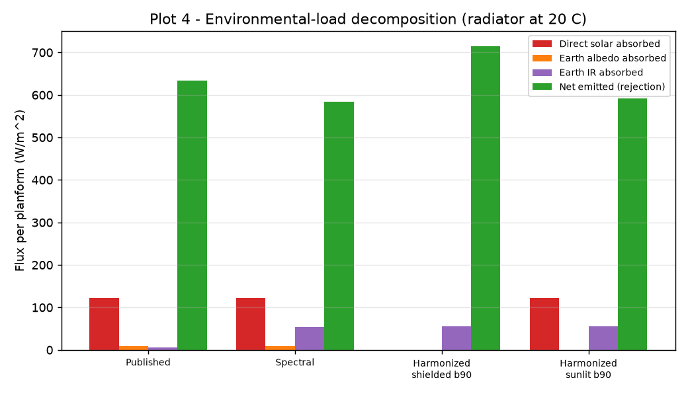
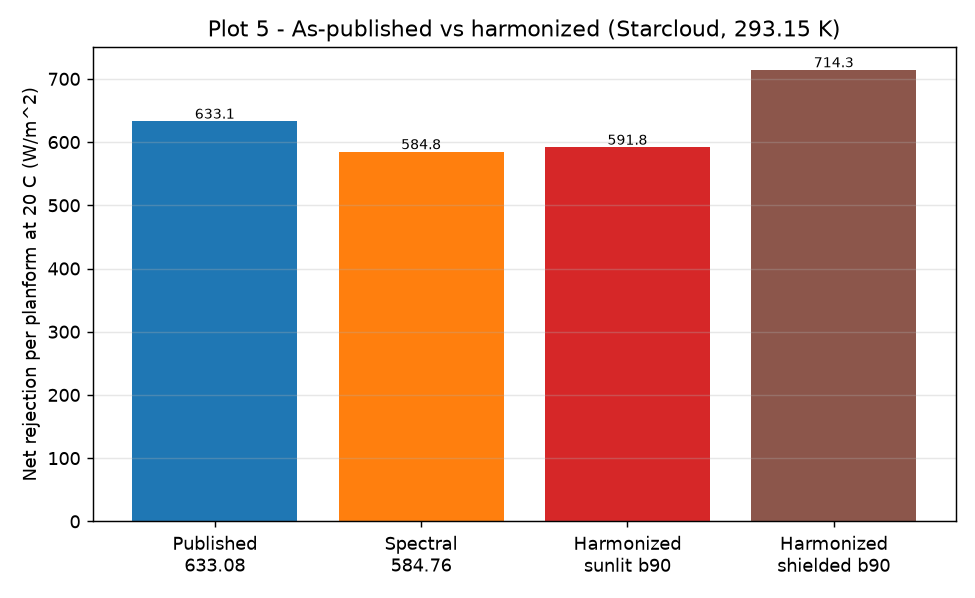
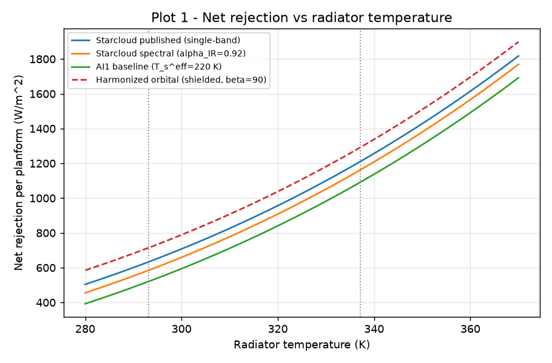
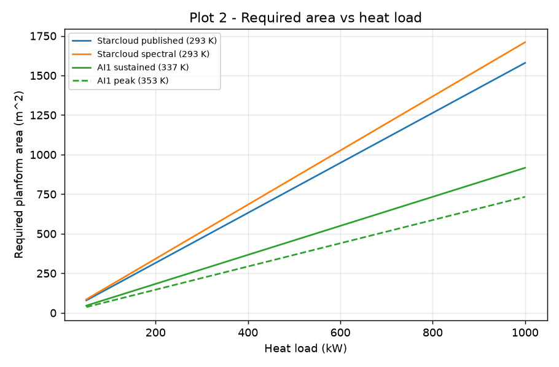
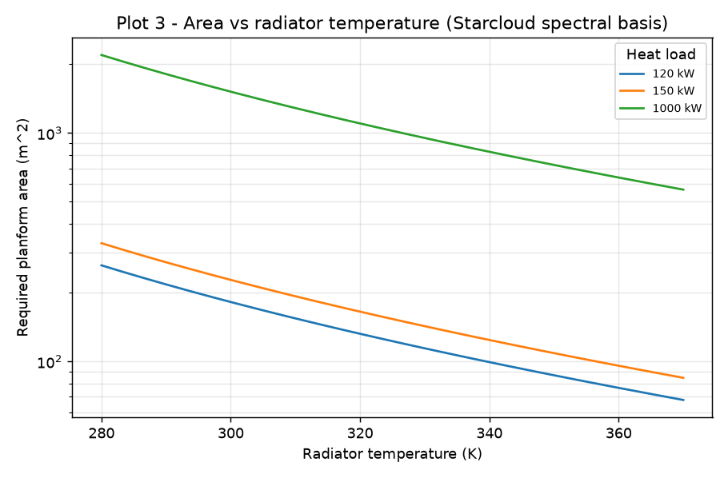

# Reference Architecture — Starcloud 2024

A reproducible thermal trade study comparing the **Starcloud (formerly Lumen Orbit)
2024 white-paper** radiator concept with the project's existing **AI1** design point.
This is a **trade study, not a verdict**: it reproduces and stress-tests a public
concept-level heat balance and compares two architectures under both their own
published assumptions and a single harmonized orbital environment. It does **not**
evaluate Starcloud's private engineering design, deployable-radiator mass, controls,
or hardware performance, and it does not establish that either architecture is
superior.

**Status:** Phase A complete (Milestones A1–A6). No preprint is produced from this
work without separate human review and approval.

**Provenance record:** [`data/reference_architectures/starcloud_2024.yaml`](../../data/reference_architectures/starcloud_2024.yaml)
**Code:** `orbital_thermal.spectral_radiation`, `orbital_thermal.reference_architectures`,
`orbital_thermal.architecture_comparison`, `orbital_thermal.harmonized_comparison`
**Tests:** `tests/test_starcloud_*.py`

---

## 1. White-paper architecture summary

Source: *Why we should train AI in space*, Lumen Orbit (now Starcloud, Inc.), White
Paper **v1.03, September 2024** (Feilden, Oltean, Johnston). The thermal balance is in
the **Thermal Management** section (pp. 8–9).

The concept is a gigawatt-class orbital data center in a low-Earth **dawn–dusk
sun-synchronous orbit (SSO)** with near-continuous solar illumination. Waste heat is
moved from modular compute containers to **large deployable radiators** through several
cooling loops (two-phase "where practical"), with direct-to-chip liquid cooling or
two-phase immersion at the chip. The radiators sit **in-line with the solar arrays,
one side exposed to direct sunlight**.

Relative to AI1, Starcloud describes a **cooler, larger-area, shared** radiator network;
AI1 is a **hotter, more compact, self-contained** radiator. The trade this document
quantifies is the **temperature ↔ area** relationship that follows from those choices.

---

## 2. Extracted inputs

All inputs are transcribed from the white paper with page-level provenance and a
status tag (`published` / `derived` / `corrected` / `assumed`) in the machine-readable
record. The published thermal inputs (all p. 9 unless noted):

### Table A — Source inputs

| Parameter | Symbol | Value | Status | Source |
|---|---|---|---|---|
| Radiator mean temperature | T_rad | 293.15 K (20 °C) | published | p. 9 |
| Radiator inlet temperature | T_in | 308.15 K (35 °C) | published | p. 9 |
| Radiator outlet temperature | T_out | 278.15 K (5 °C) | published | p. 9 |
| Thermal emissivity | ε | 0.92 | published | p. 9 (ref 21) |
| Solar absorptivity | α_solar | 0.09 | published | p. 9 (ref 21) |
| Earth-IR absorptivity (as written) | α_IR | 0.09 | published | p. 9 — single α applied to both bands |
| Earth view factor | F | 0.25 | published | p. 9 |
| Earth albedo | Al | 0.30 | published | p. 9 |
| Solar irradiance | S | 1366 W/m² | published | p. 9 |
| Earth effective temperature | T_earth | 253.15 K (−20 °C) | published | p. 9 |
| Emitting faces | — | 2 | published | p. 9 |
| Sunlit faces | — | 1 | published | p. 8 |

The white paper prints the Stefan-Boltzmann constant **rounded to 5.67×10⁻⁸**.
Reproducing its displayed values requires the same rounded constant; the SI-derived
value differs by ~0.05 W/m² (documented in the provenance record).

---

## 3. Published calculation (as written)

Reproduced exactly by `starcloud_published_balance()` (`tests/test_starcloud_published_balance.py`).

```
q_emit  = 2·ε·σ·T_rad⁴                         = 770.48 W/m²
q_sun   = α_solar·S                            = 122.94 W/m²
q_earth = α·F·(Al·S + σ·T_earth⁴)              =  14.46 W/m²   (single α = 0.09)
q_net   = q_emit − q_sun − q_earth             = 633.08 W/m²
```

### Table B — Published arithmetic reproduction

| Quantity | White paper | Reproduced | Required area |
|---|---:|---:|---|
| Emitted (two-sided) | 770.48 | 770.48 | — |
| Direct solar absorbed | 122.94 | 122.94 | — |
| Earth load (albedo + IR) | 14.46 | 14.46 | — |
| **Net rejection** | **633.08** | **633.08** | — |
| Area at 120 kW | — | — | **189.55 m²** |
| Area at 150 kW | — | — | **236.94 m²** |

(120 kW is the paper's per-rack power density, p. 11; 150 kW is a forward projection.
Areas are derived — not printed in the source.)

---

## 4. Spectral-property issue

The white paper applies the **same absorptivity (0.09)** to both Earth's reflected
sunlight (short-wave albedo) and Earth's thermal-IR emission (long-wave). For a
spectrally selective radiator coating these are generally different. A
Kirchhoff-consistent screening sets the **long-wave absorptivity equal to the thermal
emissivity** (0.92), leaving the short-wave value unchanged. This is implemented by
`kirchhoff_spectral_case()` / `starcloud_spectral_balance()` and reproduced in
`tests/test_starcloud_spectral_balance.py`.

```
q_albedo   = α_solar·F·Al·S                    =   9.22 W/m²   (unchanged, short-wave)
q_earth_IR = α_IR·F·σ·T_earth⁴  (α_IR = 0.92)  =  53.56 W/m²
q_net      = 770.48 − 122.94 − (9.22 + 53.56)  = 584.76 W/m²
```

### Table C — Spectrally separated case

| Quantity | Value | Δ vs published |
|---|---:|---:|
| Earth albedo absorbed (short-wave) | 9.22 | 0.00 |
| Earth IR absorbed (long-wave) | 53.56 | +48.32 |
| Earth combined | 62.78 | +48.32 |
| **Net rejection** | **584.76** | **−48.32** |
| Area at 120 kW | 205.21 m² | +15.66 |
| Area at 150 kW | 256.52 m² | +19.58 |

**This is a sensitivity case, not a claim that the published design is invalid.** It
shows that wavelength-dependent coating properties materially change the result: the
entire net change is the additional absorbed Earth IR.



*Plot 4 — direct solar, Earth albedo, Earth IR, and net emitted across the published,
spectral, and harmonized cases. The Earth-IR term grows from 5.2 to ~54–56 W/m² once
the long-wave absorptivity is treated separately.*

---

## 5. Harmonized model

To compare AI1 and Starcloud like-for-like, both are placed under **one** orbital
environment and one set of conventions (`orbital_thermal.harmonized_comparison`):

- Exact Earth view factor from `environment.sphere_view_factor`. At the default
  geometry (550 km, radiator edge-on to nadir, tilt = 90°) this is **F = 0.258** —
  essentially the white paper's assumed 0.25, reached from orbit geometry rather than
  assumed, and identical to the project's canonical edge-on view factor (0.257773/face).
- Package environmental constants: Earth OLR 237 W/m², solar constant 1361 W/m²,
  albedo 0.30 (`orbital_thermal.sink`).
- Orbit-mean reflected-solar drive `cos(β)/π`; SI Stefan-Boltzmann; Kirchhoff
  spectral split; **albedo and Earth IR reported separately**; per-planform fluxes
  with two-sided emission.

Two solar-exposure scenarios are produced, both labelled:

| Scenario | AI1 | Starcloud |
|---|---|---|
| **Shielded / edge-on** | `sunlit_faces = 0` | `sunlit_faces = 0` |
| **Architecture-specific** | one-side-sunlit only as a parametric sensitivity (AI1 publishes no α_solar) | `sunlit_faces = 1`, published α_solar = 0.09 |

A **β = 0–90° sweep** is supported; β = 90° is the stated dawn-dusk SSO endpoint.

> **Model limitation (surfaced, not hidden).** The package's sub-point albedo model
> returns ~0 at β = 90°, so the harmonized orbit-mean albedo vanishes there for both
> architectures regardless of absorptivity — a known limitation (the true
> disk-integrated albedo at a terminator orbit is nonzero), emitted as a
> `RuntimeWarning`. The **published** Starcloud environmental load (9.22 + 5.24 =
> 14.46 W/m²) is preserved alongside the sweep (`published_starcloud_environment()`)
> so the β = 90° null never erases it.

Representative harmonized Starcloud results at 293.15 K (per planform):

| Case | Direct solar | Earth albedo | Earth IR | Net |
|---|---:|---:|---:|---:|
| Harmonized shielded, β = 90° | 0.00 | 0.00 | 56.20 | **714.32** |
| Harmonized sunlit, β = 90° | 122.49 | 0.00 | 56.20 | **591.83** |



*Plot 5 — Starcloud net rejection at 20 °C across published, spectral, and the two
harmonized scenarios. The spread reflects the exact view factor, the spectral split,
and the solar-exposure convention — never one published case mixed with one harmonized
case in a single ranking.*

---

## 6. AI1 comparison

AI1's operating point is sourced from the existing package implementation
(`equilibrium_temperature`, effective sink T_s^eff = 220 K), never hardcoded. The
**as-published** comparison (`compare_as_published`, A4) keeps each design's own
assumptions and is explicitly **not a ranking**; AI1 publishes no solar absorptivity
or Earth view factor, so those cells read *not separately published* rather than an
invented number.

### Table D — AI1 vs Starcloud (as published)

| Attribute | AI1 | Starcloud | Unit |
|---|---|---|---|
| Radiator temperature | 337.10 (sustained) / 353.16 (peak) | 293.15 | K |
| Planform area (at 120 kW) | 110 | 189.55 | m² |
| Emitting area | 220 | 379.10 | m² |
| Net rejection / planform | 1090.91 | 633.08 | W/m² |
| Net rejection / emitting | 545.45 | 316.54 | W/m² |
| Thermal emissivity | 0.91 | 0.92 | — |
| Solar absorptivity | *not separately published* | 0.09 | — |
| Earth view factor | *lumped into T_s^eff = 220 K* | 0.25 | — |
| Direct-solar exposure | edge-on / shielded | one side sunlit | — |
| Radiator architecture | compact, higher-T, self-contained | larger-area, lower-T, shared | — |
| Coolant | ammonia (screened) | not specified (two-phase where practical) | — |

The temperature–area trade, as published: AI1 rejects 120 kW in **110 m²** because it
runs hot (337 K); Starcloud needs **189.55 m²** because it runs cool (293 K). Under the
harmonized environment the same ordering holds (AI1's higher operating temperature
gives a higher net flux), now without the convention mismatch.



*Plot 1 — net rejection per planform vs radiator temperature for the published,
spectral, AI1-baseline, and harmonized curves. Dotted lines mark Starcloud's 293 K
and AI1's 337 K operating points.*



*Plot 2 — required planform area vs heat load (50 kW – 1 MW) for the Starcloud
published/spectral cases and the AI1 sustained/peak operating points.*



*Plot 3 — required area vs radiator temperature for 120 kW, 150 kW, and 1 MW loads
(Starcloud spectral basis, log area axis), illustrating the steep area penalty of
running cool.*

### Table E — Sensitivity

| Varied quantity | From → to | Effect on Starcloud net (W/m²) |
|---|---|---|
| Earth-IR absorptivity | 0.09 → 0.92 (Kirchhoff) | 633.08 → 584.76 |
| View factor + constants | paper (F=0.25, σ rounded) → harmonized (F=0.258, SI σ) | published → ~714 (shielded) |
| Solar exposure | shielded → one-side sunlit (harmonized) | 714.32 → 591.83 |
| Stefan-Boltzmann constant | 5.67×10⁻⁸ → SI value | 633.08 → 633.13 |
| Radiator temperature | 280 → 370 K | see Plot 1 (≈ T⁴ scaling) |

---

## 7. Unknowns (kept unknown)

The white paper does not disclose, and this study does **not** invent, the following.
They remain unknown, parametric, or future-data requirements (full list in the
provenance record):

coolant identity · coolant saturation temperature and pressure · mass-flow rate ·
pump efficiency and power · pipe geometry and pressure drop · heat-exchanger
effectiveness · radiator areal density and total mass · coolant inventory ·
chip-to-radiator temperature drop · heat-pump COP · failure tolerance · two-phase loop
control · deployment/thermal-expansion constraints.

AI1 publishes no solar absorptivity; its harmonized albedo and any direct-solar term
are therefore left uncomputed (or treated as an explicit parametric sensitivity), never
assigned a fabricated value.

---

## 8. Scope and limitations

- This is a **reduced-order** screening comparison: flat-plate radiator, single
  Earth-facing view factor for environmental absorption, orbit-averaged albedo, no
  eclipse transient, no deployable-structure or mass modelling.
- The spectral-separation case is an **alternative radiative-property treatment**, not
  a claim that the published design is invalid.
- The comparison identifies **temperature–area tradeoffs under public assumptions**; it
  does not establish total-system superiority (mass, parasitic power, reliability).
- The harmonized albedo is **under-counted at high β** by the package's sub-point
  model; the published environmental load is preserved as a reference.
- Not validated against flown hardware; not for flight design or certification.

Defensible summary statement: *Starcloud's concept trades larger radiator area and
deployable-structure scale for a cooler shared thermal network, while AI1 trades a
higher operating temperature for more compact radiator area. Public information is
insufficient to determine which architecture has lower total mass, lower parasitic
power, or better lifecycle reliability.*

---

## 9. Reproduction

```bash
pip install -e ".[dev]"            # numpy + matplotlib (figures) + pytest/ruff

# Reproduce every Starcloud number (A2–A5)
python -m pytest tests/test_starcloud_published_balance.py \
                 tests/test_starcloud_spectral_balance.py \
                 tests/test_starcloud_ai1_published_comparison.py \
                 tests/test_starcloud_ai1_harmonized.py -q

# Regenerate the five figures into docs/reference-architectures/figures/
python scripts/plot_starcloud.py
```

```python
from orbital_thermal.reference_architectures import (
    starcloud_published_balance, starcloud_spectral_balance)
from orbital_thermal.architecture_comparison import compare_as_published
from orbital_thermal import harmonized_comparison as h

starcloud_published_balance().net_rejection_W_m2     # 633.08
starcloud_spectral_balance().net_rejection_W_m2      # 584.76
print(compare_as_published(120e3).render_text())     # as-published table
h.starcloud_harmonized_balance(90, sunlit_faces=1)   # harmonized, one-side sunlit
```

---

## 10. Source citation

> Ezra Feilden, Adi Oltean, Philip Johnston. *Why we should train AI in space.*
> Lumen Orbit (now Starcloud, Inc.), White Paper v1.03, September 2024.
> <https://starcloudinc.github.io/wp.pdf> (mirror: <https://lumenorbit.github.io/wp.pdf>),
> retrieved 2026-06-16. Thermal Management, pp. 8–9.

AI1 design point: *The AI1 Design Point*, DOI
[10.5281/zenodo.20670771](https://doi.org/10.5281/zenodo.20670771). Edge-on geometry:
DOI [10.5281/zenodo.20695720](https://doi.org/10.5281/zenodo.20695720).

Source white-paper text is third-party copyright (Starcloud/Lumen Orbit); only
extracted numerical inputs and short factual descriptions are stored here for
reproduction and commentary. Project code is MIT-licensed.

> A Wiki page (*Reference Architecture — Starcloud 2024*) should be added only after
> this repository documentation is reviewed and stable.
